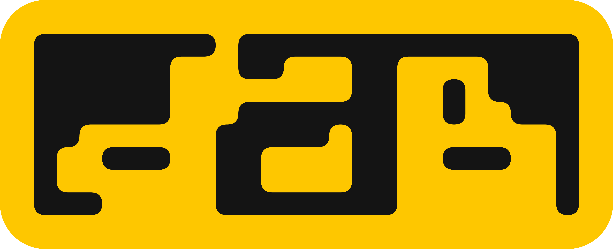
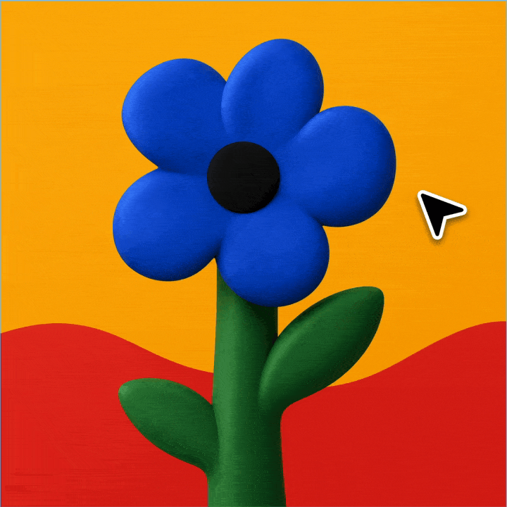
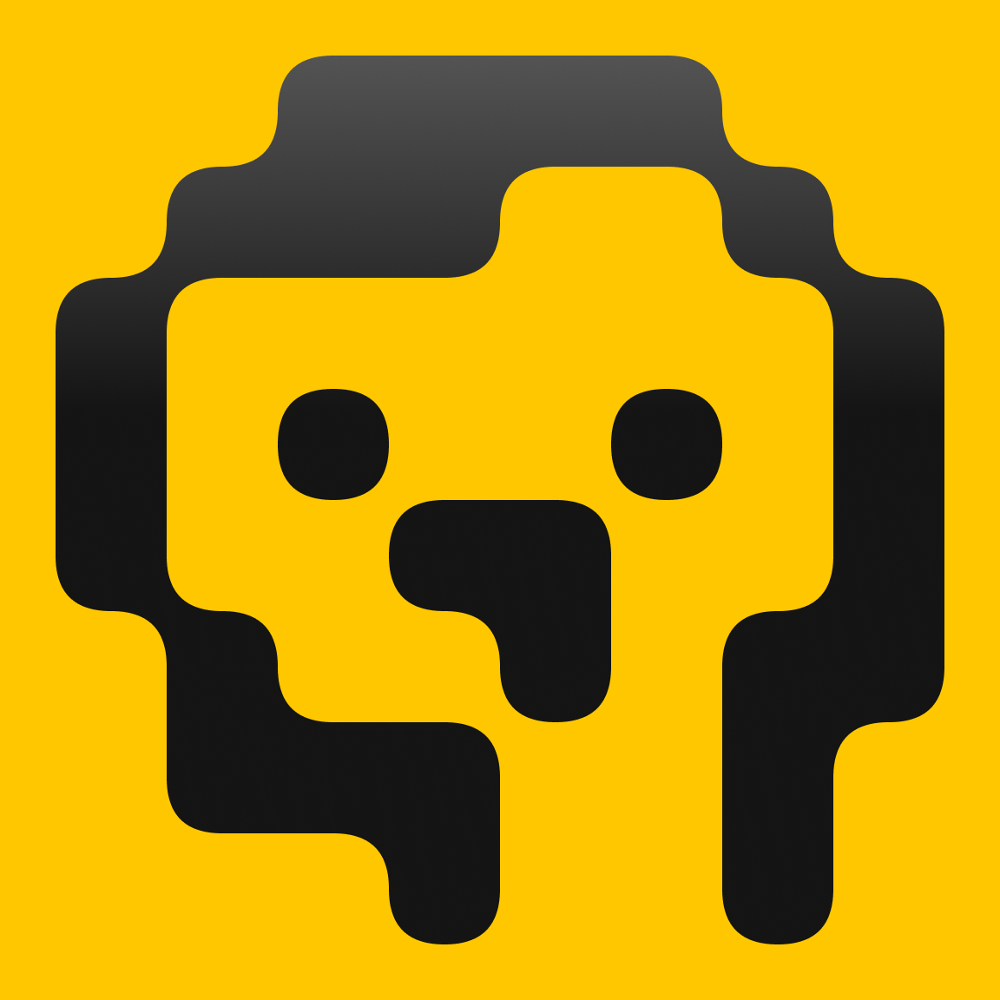

<p align="center">
  
</p>

Silly little tool to make silly little graphics. Started as an internal tool
at the studio, but was too charming to keep it internal-only. It turns any
patch of the screen into pixel art.

Fire up capture and a preview replaces your cursor. Rotate through the
options using the shortcuts until you like what you see. Click and it gets
saved as an SVG file. Take the SVG to your favorite graphics editor and have
fun. Always have fun.

<p align="center">
  
</p>

## How it works

- **Capture** — a global hotkey (default `` ⌃⇧` ``) opens a borderless overlay
  that tracks the mouse and re-renders ~30×/s from a ScreenCaptureKit stream.
- **Quantize** — each grid cell is matched against your palette through one of
  four filters: **Color Match** (nearest color, per-pixel voting), **Threshold**
  (brightness bands), **Halftone** (Bayer-dithered bands), or **Outline**
  (Sobel edges).
- **Render** — three arrangements: **squares** (classic pixels), **dots**
  (rounded blobs on a dominant-color ground), **blobs** (rounded regions with
  palette-order grout).
- **Save** — click captures the current frame to SVG. Vector output, so the
  result scales to print size.

## Overlay controls

| Key | Action |
|---|---|
| `← / →` | resize viewport |
| `↑ / ↓` | grid size (4–64) |
| `+ / -` | the current filter's dial (spread, threshold, or edge sensitivity) |
| `shift` + any of the above | larger jumps |
| `f` | cycle filter mode |
| `r` | cycle squares / dots / blobs |
| `c` | cycle palettes |
| `z` | palette randomizer |
| `h` / `v` | mirror horizontally / vertically |
| `space` | invert |
| `esc` | close |
| click | save SVG and close |

Palettes are editable in Settings (up to 8 swatches, one of them optionally
see-through), with built-in presets and room to save your own.

## Palettes

| Preset | Colors |
|---|---|
| lite brite | `#000000` `#17AE65` `#F14729` `#FDE012` `#006AFF` |
| locker room | `#06286B` `#BD4527` `#3B829C` `#DA9678` `#B9E2F2` |
| damiana | `#040C05` `#ED980A` `#E6D8FA` |
| sunburn | `#0033B8` `#E12A1C` `#1E8CF0` `#FFC01F` |
| hot glass | `#336234` `#FF9601` `#E9E9E8` |

## Install

Download the latest `.dmg` from
[Releases](https://github.com/JaimeOrtegaxyz/dab/releases), mount it, and drag
dab to `/Applications`. The app is notarized and updates itself via Sparkle.

Requires **macOS 14+** on **Apple silicon**. dab needs two permissions to
function — **Screen Recording** (to sample pixels) and **Accessibility** (for
the overlay's keyboard controls); it prompts for both on first run.

## Build from source

```
git clone https://github.com/JaimeOrtegaxyz/dab.git
cd dab
./build.sh
open dab.app
```

`build.sh` produces a locally-signed development bundle. Plain `swift build`
works too if you only want the binary compiled.

## License

[MIT](LICENSE)

<p align="center">
  
</p>
